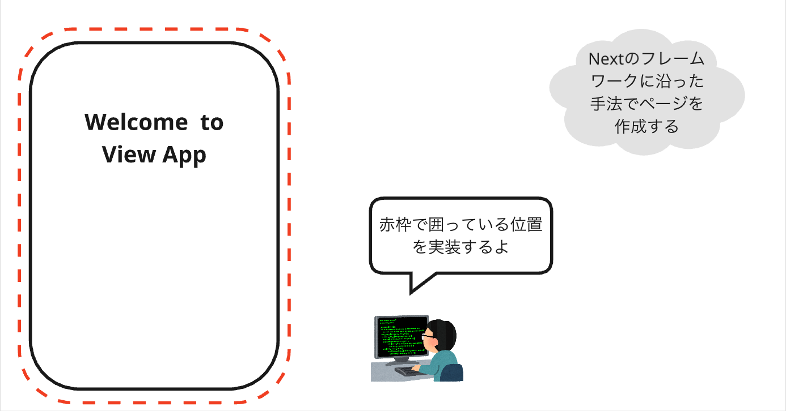

# 1. ログインページの作成: ローカル起動
まずは、ページを作成して、ローカル（このPC上のこと）環境でデバッグサーバーを起動してみます。  

## イメージ


## ページの作成
`puri-image-viewer/apps/web/src/app/login`ディレクトリを作成し、その配下に`page.tsx`ファイルを作成してください。
`page.tsx`を`TypeScript`で以下のように実装します。

**app/login/page.tsx**
```ts
export default function Page() {
    return (
        <h1>Hello! Login Page</h1>
    );
}
```

>**TypeScript:**  
>JavaScriptに型の概念を追加したプログラミング言語です。型を使うことで、プログラムの誤りを事前に発見しやすくなり、より安全で信頼性の高いコードを書くことができます。

> **React**:  
> Meta社（旧Facebook）が開発したJavaScriptライブラリで、ユーザーインターフェース（UI）を構築するために使用されます。Reactを使うと、複雑なUIを簡単に作成し、管理することができます。

>**TSX**:  
>TypeScriptとXML（HTMLに似た構文）を組み合わせたものです。UIを作成する際に使われます。TSXを使うことで、HTMLのような構文でReactコンポーネントを記述でき、TypeScriptの型チェックも利用できます。  

## デバッグ起動
上記で作成したログインページをデバッグ起動して確認してみます。  
ショートカットキー`control+@`でエディター上でコマンドを実行するためのターミナルを開きます。  

>**デバッグ**:  
>プログラムの誤りを見つけて修正するための作業です。  
>デバッグ起動を行うことで、サーバーにプログラムをアップロードする手間もなく動作を確認できます。

コンソールに以下のコマンド($に続く文字列)を入力します。
```sh
# Next.jsなど必要なライブラリ（道具、部品）をインストールします.
$ pnpm i
# デバッグ起動します.
$ pnpm dev
```

>**pnpm**:  
>Node.jsのパッケージマネージャーの一つです。  
>パッケージマネージャーとは、プログラムの部品（パッケージ）を管理し、簡単にインストールやアップデートができるツールです。

ターミナルで以下のようなに表示されたら起動成功です。
```sh
▲ Next.js 15.x.x
- Local:    http://localhost:3000
- Environments: .env
```

SafariやChromeなどのブラウザで、`http://localhost:3000/login`にアクセスしてみてください。  
上記で作成したページが表示されます。  
これはNext.jsの`App Router`という機能になります。  `app`ディレクトリ下に`app/login/page.tsx`のようにディレクトリと`page.tsx`を作成すると、自動的にそのディレクトリでURLを割り振ってくれます。
詳しくは[こちら](https://nextjs.org/docs/app/building-your-application/routing)を参考。

### ホットリロード
また、Next.jsはホットリロード（コードを変更すると、ページをリロードせずに自動的に変更が反映される機能）に対応しています。   
```<h1>Welcome to Puri Viewer!</h1>```のように`login/page.tsx`を修正して、先ほど開いたブラウザを確認にすると、コマンドを再実行することなく、画面が更新されることが確認できます。  
素早く修正が確認できるため開発体験が向上します。

**app/login/page.tsx**
```ts
export default function Page() {
    return (
        <h1>Welcome to Puri Viewer!</h1> {/* ここを変更してみる */}
    );
}
```

## Next
次は[ログインページの作成: 入力フォーム](./2_ログインページの作成_入力フォーム.md)へ。
