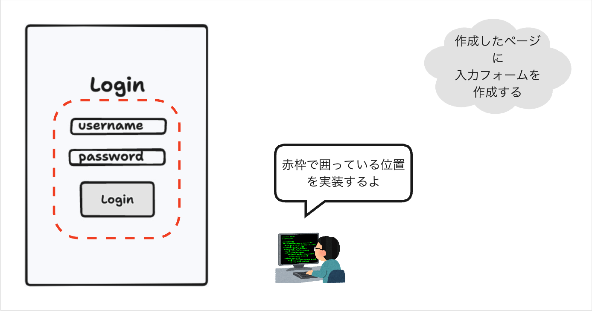
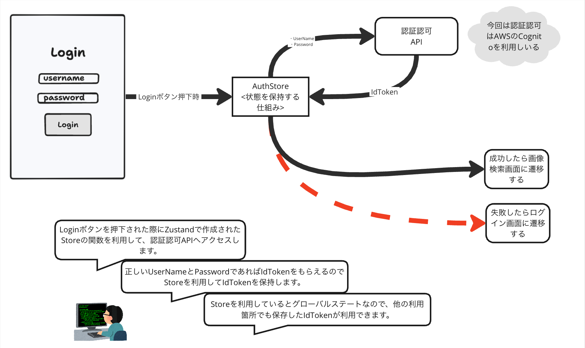

# 2. ログインページの作成: 入力フォームの作成
ログインするための入力フォームの作成を行います。

## イメージ


## 入力フォームの作成
`puri-image-viewer/apps/web/src/app/login/page.tsx`を変更して、ID/パスワードでログインするためのフォームを作成します。

**app/login/page.tsx**
```ts
// Next.jsのクライアントコンポーネントを示すための宣言です。
// 入力フォームはクライアントサイド（ブラウザ）で動作するため、この宣言が必要になります。  
'use client';

export default function Page() {
    return (
        <>
            <h1>Welcome to Puri Viewer!</h1>
            <p>This is a image viewer application for internship.</p>
            <form onSubmit={(e) => {
                // `e.preventDefault()`はフォームのデフォルトの送信動作を防ぐためのものです
                e.preventDefault();
                console.log('Login button was clicked.');
            }}>
                <div>
                    <label>Username</label>
                    <input id="username" type="text" placeholder="username" />
                </div>
                <div>
                    <label>Password</label>
                    <input id="password" type="password" placeholder="password" />
                </div>
                <button type="submit">Log in</button>
            </form>
        </>
    );
}
```
- inputタグのtype属性に`text`を指定することで、テキスト入力欄を作成します。
- inputタグのtype属性に`password`を指定することで、パスワード入力欄を作成します。
    - パスワード入力欄は、入力した文字が表示されず、`*`などで隠されるようになります。
- buttonタグのtype属性に`submit`を指定することで、ボタンをタップすると、フォームの`onSubmit`関数が呼び出されるようになります。  

ブラウザで確認すると、テキストフィールドとログインボタンが表示されます。
ログインボタンを押下すると、`console.log`により、ブラウザのコンソールに`Login button was clicked.`が出力されます。  
Chromeであれば、`option + command + i`でデベロッパーツールを開くことができるので、上部のConsoleタブを開いて確認してみてください。

>**関数とは？**  
>関数とは、特定の処理をまとめたもので、必要なときに呼び出して使うことができます。  
>例えば、数学の関数（f(x) = x + 1）のように、入力に対して決まった出力を返すものです。  
>ソフトウェアを動かすプログラムは、値を格納するための`変数`と、特定の処理を行うための`関数`で構成されています。  
>JavaScriptでは、関数も値として扱うことができ、変数に格納することができます。


## ユーザー名/パスワードの入力値を取得
ReactのHook関数を利用して、ユーザー名とパスワードの入力値を取得します。   
ここでは、`useState`というHook関数を使って、入力値の状態を管理します。

>**Hook関数**:  
>簡単に説明すると、Reactの関数コンポーネント内で状態やライフサイクルの機能を使うための関数です。  

**app/login/page.tsx**
```ts
'use client';

import { useState } from "react";

export default function Page() {
    // `useState`は、現在の値とその値を更新する関数を返します。
    // ここでは、`username`と`password`は現在の入力値を保持します。
    // `setUsername`と`setPassword`は、`username`と`password`の値を更新する関数です。
    const [username, setUsername] = useState('');
    const [password, setPassword] = useState('');

    return (
        <>
            <h1>Welcome to Puri Viewer!</h1>
            <p>This is a image viewer application for internship.</p>
            <form onSubmit={(e) => {
                e.preventDefault();
                console.log('Login button was clicked.');

                if (!username || !password) {
                    alert('Username or Password is Empty.');
                    return;
                }
                console.log('username:', username);
                console.log('password:', password);
            }}>
                {/* `onChange`は、入力値が変更された際に呼び出される関数であり、`setUsername`と`setPassword`を呼び出して、入力値を更新します */}
                <div>
                    <label>Username</label>
                    <input 
                        id="username" 
                        type="text" 
                        placeholder="username" 
                        onChange={(e) => setUsername(e.target.value)} 
                    />
                </div>
                <div>
                    <label>Password</label>
                    <input 
                        id="password" 
                        type="password" 
                        placeholder="password" 
                        onChange={(e) => setPassword(e.target.value)} 
                    />
                </div>
                <button type="submit">Log in</button>
            </form>
        </>
    );
}

```

UsernameとPasswordのどちらかを入力せずに、ログインボタンを押下すると、ブラウザのアラートで`Username or Password is Empty.`と表示されます。  
どちらも入力している場合は、ブラウザのコンソールに`username:xxx`と`password:xxx`が出力されるようになっているはずです。

## ログイン処理の実装

ユーザー名とパスワードの入力値が取得できるようになったので、以下の画像のイメージでログイン処理を作成していきます。  
状態管理ライブラリの`zustand`を利用して、ログイン処理と状態を管理するようにします。



`puri-image-viewer/apps/web/src/stores`ディレクトリを作成し、その配下に`authStore.ts`ファイルを作成してください。
`puri-image-viewer/apps/web/src/stores/authStore.ts`に下記の内容を実装します。

**authStore.ts**
```ts
/* eslint-disable no-unused-vars */
import { StateCreator, createStore } from "zustand/vanilla";
import { IDToken } from "@web/lib/auth/types";
import { API_BASE_URL } from "@web/constants";

// インターフェースは、型安全性を向上させるために、オブジェクトの構造を定義するものです.
// ここでは、`AuthStore`というインターフェースを定義し、`idToken`プロパティと`login`アクションを持つことを宣言しています.
interface AuthStore {
    // ログインに成功したときにサーバーから受け取るトークン.これを使ってユーザーの認証状態を管理します.
    // 型情報は、事前に定義されたものを利用します.
    readonly idToken?: IDToken;

    // `Promise`は、非同期処理の結果を返すためのものです.
    // 非同期処理にすることで、画面をブロックしてユーザー体験が悪くなることを防いでいます.
    // `login`は、ユーザー名とパスワードを受け取り、IDトークンを返すか、ログインに失敗した場合は`undefined`（存在しない値を表す）を返します.
    login: (username: string, password: string) => Promise<IDToken | undefined>;
}

const authStoreCreator: StateCreator<AuthStore> = (set) => ({
    // 今回はエラーが発生した場合は考慮していません.
    login: async (username, password) => {
        // fetch関数でサーバーにログインリクエストを送信します.
        const response = await fetch(`${API_BASE_URL}/auth`, {
            method: 'POST',
            headers: {
                'Content-Type': 'application/json',
            },
            body: JSON.stringify({ username, password }),
        });
        if (!response.ok) {
            set({ idToken: undefined });
            return undefined;
        }
        const result = await response.json();
        const idToken = IDToken.from(result.idToken);
        // set関数を利用して、IDトークン（ログイン状態）を更新します.
        set({ idToken });

        return idToken;
    },
});

const authStore = createStore(authStoreCreator);
// 外部から参照できるようにするために、exportしておく必要があります.
export default authStore;

```

上記で作成した`authStore`を`puri-image-viewer/apps/web/src/app/login/page.tsx`にimportし、`authStore`を利用してログインボタンが押下された際の処理を実装します。
`puri-image-viewer/apps/web/src/app/login/page.tsx`を下記のように変更します。

**app/login/page.tsx**
```ts
'use client';

import { useState } from "react";
import { useStore } from "zustand";
import authStore from "@web/stores/authStore";

export default function Page() {
    const [username, setUsername] = useState('');
    const [password, setPassword] = useState('');
    // zustandがReact用に提供するHook関数（`useStore`）を利用して、上記で定義した`authStore`の`login`関数を取得します.
    const login = useStore(authStore, (state) => state.login);
    // onSubmitに代入していた関数を変数に切り出すことで、プログラム全体が見やすくなります（リファクタリング）.
    // `useCallback`は、画面が再描画されるたびに関数が再生成されるのを防いでくれます.
    const handleSubmit = useCallback(async (e: React.FormEvent<HTMLFormElement>) => {
        e.preventDefault();

        if (!username || !password) {
            alert('Username or Password is Empty.');
            return;
        }
        // ログイン処理を実行して、IDトークンを取得します. IDトークンが存在する場合はログイン成功です.
        const idToken = await login(username, password);
        confirm(`Login is ${
            idToken ? 'success' : 'failure'
        }.`)
    // 関数が依存する変数を指定しています.この変数が変更された場合に、関数が再生成されるようにします.
    }, [login, username, password]);

    return (
        <>
            <h1>Welcome to Puri Viewer!</h1>
            <p>This is a image viewer application for internship.</p>
            <form onSubmit={handleSubmit}>
                <div>
                    <label>Username</label>
                    <input 
                        id="username" 
                        type="text" 
                        placeholder="username" 
                        onChange={(e) => setUsername(e.target.value)} 
                    />
                </div>
                <div>
                    <label>Password</label>
                    <input 
                        id="password" 
                        type="password" 
                        placeholder="password" 
                        onChange={(e) => setPassword(e.target.value)} 
                    />
                </div>
                <button type="submit">Log in</button>
            </form>
        </>
    );
}

```

変更できたら、[ログインユーザー](./index.md#ログインユーザー)でログインしてみましょう。  
パスワードが正確であれば、ログインが成功するはずです。

### zustandとは？
`zustand`は状態管理を行うためのライブラリです。状態管理とは、アプリケーション内で使用されるデータや情報を管理することを指します。  
例えば、ユーザーのログイン状態や、フォームに入力されたデータなどが状態に含まれます。

<!-- `zustand`の機能の一つで状態を永続化するための機能です。  
storeを作成する際に、`persist`を指定することで、storeの状態が永続化されます。  
`persist`を利用することで、stateを`localStorage`等に保存することができます。  
`localStorage`に保存する際には、`key`を指定する必要があります(localStorageに保存されるkeyは、`persist`の引数に指定したkeyになります)。  
これにより、ブラウザがリロードされても`state`を保持することができます。   -->

***なぜ状態管理ライブラリを利用するのか？***

状態管理の難しさには[Redux](https://redux.js.org/understanding/thinking-in-redux/motivation)（状態管理ライブラリの一つ）の公式にも記述されています。
>JavaScript のシングルページアプリケーションの要件がますます複雑になるにつれて、コードはこれまで以上に多くの状態を管理する必要があります。  
>この状態には、サーバーのレスポンスやキャッシュされたデータ、まだサーバーに永続化されていないローカルに作成されたデータなどが含まれます。UIの状態も複雑化しており、アクティブなルート、選択されたタブ、スピナー、ページネーションコントロールなどを管理する必要があります。この常に変化する状態を管理するのは大変なことです。モデルが別のモデルを更新できるなら、ビューはモデルを更新でき、そのモデルが別のモデルを更新し、さらにそれが別のビューを更新させるかもしれません。ある時点で、アプリで何が起こるかわからなくなり、いつ、なぜ、どのように状態を制御するのかがわからなくなります。システムが不透明で非決定的であると、バグの再現や新機能の追加が難しくなります。

と、記述されている通り、昨今の状態管理は非常に複雑性がましてきています。  
複雑度を少しでも下げるために、状態管理ライブラリを採用しています。

## スタイリング

シンプルなHTML要素のみでフォームを作成しました。  
次は、フォームを見やすくするためにスタイリングを行います。
スタイリングには[index.md](./index.md)で紹介した、**CSS Modules**を使用します。
>**CSS Modules:**  
>CSSを使ってアプリケーションの見た目を整えるための方法。  
>各コンポーネントごとにスタイルを設定できるので、他の部分に影響を与えずにデザインを変更できる。

`puri-image-viewer/apps/web/src/app/login`ディレクトリの配下に`page.module.css`ファイルを作成してください。
`page.module.scss`を`CSS`で以下のように実装します。  
今回はCSSの構文や各プロパティについては詳しくは説明しません。  
余裕がある場合は各プロパティについて調べてみて、数値や色を変更してみてください。

**app/login/page.module.scss**
```scss
@import 'variables';

.container {
    display: flex;
    // ビューポートの高さの100%に設定することで、常に画面全体の高さを占めるようにする.
    min-height: 100vh;
    // `--background-color`は、`puri-image-viewer/apps/web/src/styles/variables.scss`で変更可能です.
    // varでhなく、url(https://~~)でURLを指定することで、画像を背景に設定することも可能です.
    background-color: var(--background-color);
    background-size: cover;
    background-position: center;
    transition: background-color 0.3s ease;
}

.content {
    flex: 1;
    padding: 2rem;
    display: flex;
    flex-direction: column;
    justify-content: center;
    max-width: 480px;
    margin: 0 auto;
    gap: 1rem;
}

.form {
    display: flex;
    flex-direction: column;
    gap: 1rem;

    .inputContainer {
        display: flex;
        flex-direction: column;
        gap: 0.1rem;

        .label {
            font-size: $font-size-small;
        }
        .input {
            border-radius: calc(0.5rem + $font-size);
            border-width: 0.075rem;
            border-style: solid;
            font-size: $font-size;
            padding: 0.5rem 1rem;
            background-color: transparent;
        }
    }

    .button[type="submit"] {
        margin: 2rem 0;
        background-color: var(--primary-color);
        border-color: var(--primary-color);
        color: white;
    
        cursor: pointer;
        transition: background-color 0.3s ease;
        border-style: solid;
        border-width: 0.1rem;
        border-radius: calc(0.5rem + $font-size);
        font-size: $font-size;
        padding: 0.5rem 1rem;
    
        &:active {
            background-color: var(--focus-primary-color);
            border-color: var(--focus-primary-color);
        }
        &:disabled {
            cursor: not-allowed;
        }
    }
}

```

## フォームにスタイルを適用します
`puri-image-viewer/apps/web/src/app/login`ディレクトリの配下にある`page.tsx`ファイルを以下のように修正します。

**app/login/page.tsx**
```ts
'use client';

import { useCallback, useState } from "react";
import { useStore } from "zustand";
import authStore from "@web/stores/authStore";
// CSS Modulesをインポートします.
import styles from './page.module.scss';

export default function Page() {
    const [username, setUsername] = useState('');
    const [password, setPassword] = useState('');

    const login = useStore(authStore, (state) => state.login);
    const onSubmit = useCallback(async (e: React.FormEvent<HTMLFormElement>) => {
        e.preventDefault();

        if (!username || !password) {
            alert('Username or Password is Empty.');
            return;
        }
        const idToken = await login(username, password);
        confirm(`Login is ${
            idToken ? 'success' : 'failure'
        }.`)
    }, [login, username, password]);

    // `className`に上記で定義した各CSSクラスを指定することで、　各要素にスタイルを適用します.
    return (
        <div className={styles.container}>
            <div className={styles.content}>
                <h1>Welcome to Puri Viewer!</h1>
                <p>This is a image viewer application for internship.</p>
                <form className={styles.form} onSubmit={onSubmit}>
                    <div className={styles.inputContainer}>
                        <label className={styles.label}>Username</label>
                        <input 
                            id="username" 
                            type="text" 
                            placeholder="username" 
                            onChange={(e) => setUsername(e.target.value)} 
                            className={styles.input}
                        />
                    </div>
                    <div className={styles.inputContainer}>
                        <label className={styles.label}>Password</label>
                        <input 
                            id="password" 
                            type="password" 
                            placeholder="••••••••••" 
                            onChange={(e) => setPassword(e.target.value)} 
                            className={styles.input}
                        />
                    </div>
                    <button type="submit" className={styles.button}>Log in</button>
                </form>
            </div>
        </div>
    );
}

```

これで、入力フォームの入力フォームのスタイリングが完了しました。  
ブラウザをリロードしてみて、入力フォームのスタイルを確認してみてください。それなりに整った見た目になっているはずです。

## Next
次は[画像検索ページの作成_入力フォーム_ログインチェック](./3_画像検索ページの作成_入力フォーム_ログインチェック.md)へ。
