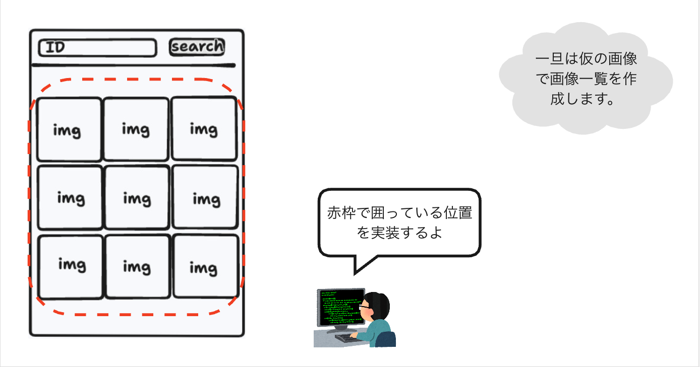

# 4. 画像検索ページの作成: 画像一覧表示
最後に画像検索ページでIDを入力し、サーバーから返却される結果をもとに画像一覧表示を作成します。

## 画像検索ページの作成


---

## 画像一覧の作成
まずは、ログイン時に取得したIDトークンを使って、サーバーから画像一覧を取得するWebAPIを呼び出します。  
`puri-image-viewer/apps/web/src/app/page.tsx`に下記の実装を追加します。  
画像をグリッド状に表示するために、`puri-image-viewer/apps/web/src/app/page.module.scss`にもスタイルを追加します。

**app/page.tsx**
```ts
'use client';

import styles from './page.module.scss';
import { useCallback, useEffect, useState } from 'react';
import authStore from '@web/stores/authStore';
import { useRouter } from 'next/navigation';
import { useStore } from 'zustand';
import { API_BASE_URL } from '@web/constants';

// サーバーから取得できる画像の型を定義します（今回は`url`のみ利用します）.
type Image = {
    readonly size: number;
    readonly name: string;
    readonly lastModified: Date;
    readonly url: string;
};

export default function Page() {
    const router = useRouter();
    // authStoreからIDトークンを取得します.
    const idToken = useStore(authStore, (state) => state.idToken);
    const [inputSealId, setInputSealId] = useState('');
    // サーバーから取得した画像一覧を保持するためのstateを定義します.
    // 初期値は空の配列とします（`[]`）.
    const [images, setImages] = useState<Image[]>([]);

    useEffect(() => {
        authStore.persist.onFinishHydration((auth) => {
            if (!auth.idToken || auth.idToken.expired) {
                router.replace('/login');
            }
        });
        authStore.persist.rehydrate();
    }, []);

    const handleSubmit = useCallback(async (e: React.FormEvent<HTMLFormElement>) => {
        e.preventDefault();
        // 検索時にログインの有効期限が切れている場合はログインページに遷移させるようにします.
        if (!idToken || idToken.expired) {
            router.replace('/login');
            return;
        }
        // サーバーから画像一覧を取得するWebAPIを呼び出します.
        // WebAPIの仕様に従い、urlのパスに検索するIDを埋め込みます.
        // 今回はエラーが発生した場合は考慮していません.
        const response = await fetch(`${API_BASE_URL}/seals/${inputSealId}/images`, {
            method: 'GET',
            headers: {
                // 認可を必要とするため、リクエストヘッダーにログインで得られたIDトークンを指定します.
                'Authorization': idToken?.raw,
            },
        });
        if (!response.ok) {
            setImages([]);
            return;
        }
        const result = await response.json() as Image[];
        // サーバーから取得された結果で画像一覧を更新します.
        setImages(result);
    }, [inputSealId, idToken, router]);

    return (
        <div className={styles.container}>
            <form className={styles.form} onSubmit={handleSubmit}>
                <input
                    id="sealId"
                    type="text"
                    placeholder="id"
                    onChange={(e) => setInputSealId(e.target.value)}
                    className={styles.input}
                />
                <button className={styles.button} type='submit'>Search</button>
            </form>
            {/* 
                画像一覧をmap関数で展開します. 
                この関数は、配列の各要素に対して、指定された関数を実行し、その結果を新しい配列として返します.
                ここでは、imgタグに取得した画像のURLを指定して、画像を表示するUIに変換しています.
            */}
            <div className={styles.imagesContainer}>
                {images.map((image) => (
                    <div key={image.name}>
                        
                    </div>
                ))}
            </div>
        </div>
    );
};

```

**app/page.module.scss**
```scss
// 省略
// 以下を追加
.imagesContainer {
    margin-top: 2rem;
    display: grid;
    grid-template-columns: repeat(auto-fill, minmax(10rem, 1fr));
    gap: 0.5rem;

    .image {
        width: 100%;
        height: 100%;
        object-fit: cover;
        display: block;
        border-radius: 0.5rem;
    }   
}

```

これで画像検索する準備が整いました。  
下記のデバッグ用のIDを入力して検索して、画像がグリッド状に表示されるかどうか確認できます。  
- `hamu`

## Next

次は[5. デプロイメント](./5_デプロイメント.md)へ。
