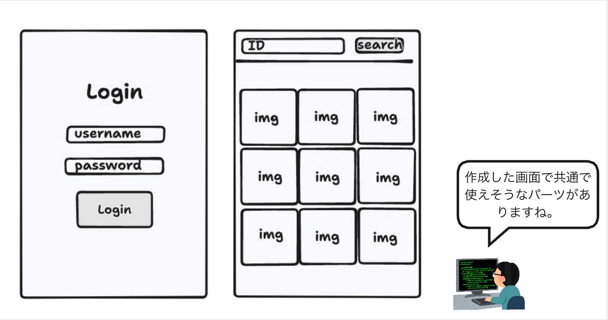
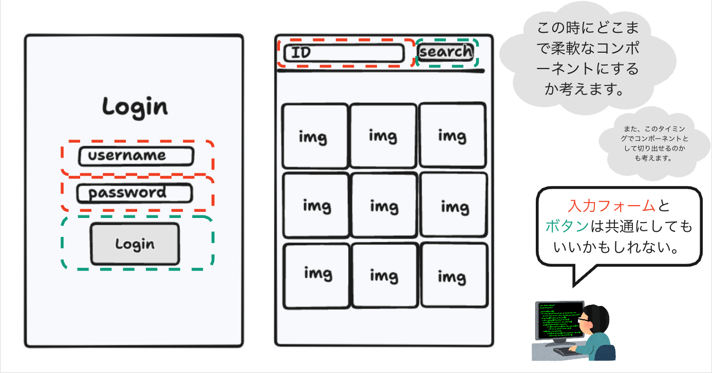
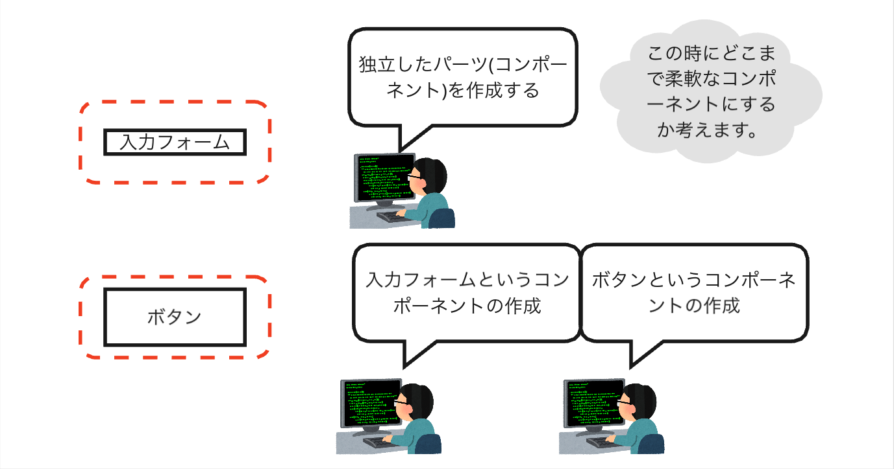

# 7. （**チャレンジ**）リファクタリング: コンポーネント化

[6. UX改善_ローディング表示](./6_UX改善_ローディング表示.md)では、ローディングのUIコンポーネントを作成しました。
次は、ログイン画面と画像検索画面の共通部分をコンポーネント化して、コードをリファクタリングしてみましょう。

>**リファクタリング:**  
> 既存のコードを改善し、コードの再利用性や可読性を向上させるプロセスのことです。  
> これには、コードの重複を削除し、ロジックを整理し、コンポーネント化するなどの作業が含まれます。

## リファクタリングのイメージ

---

---

---

## Next

次は[拡大画面の作成](./8_拡大画面の作成.md)をしていきます。
