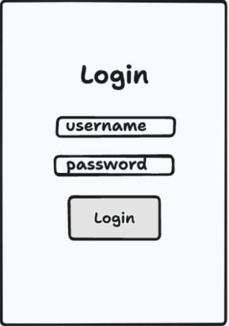

# インターンシップ ワークショップ ver ビューワーアプリ

## ワークショップ概要
プリントシール機で撮影し、サーバーにアップロードされた画像を検索して表示するWebアプリケーションを作成します。  
Webアプリケーションはインターネットに公開するため、検索には認可が必要になります。そのため、ログイン画面からの作成も行います。 

>**認可**:  
> パスワードを入力して得られるトークン（文字列）を使って検索する必要がある（所謂ログインと呼ばれる行為）

このワークショップでは、実務に近い体験をするために、可能であればペアプログラミングの手法を採用することをオススメします。  
>**ペアプログラミング:**  
>2人のプログラマーが1台のPCを共有して一緒にコードを書く開発手法です。  
>1人が実際にコードを入力し（ドライバー）、もう1人がアイデアを出したりコードをレビューしたりします（ナビゲーター）。  
>この方法により、コードの品質向上や知識共有が促進されます。

一定間隔でドライバーとナビゲーターの役割を交代しながら、開発を進めてみてください。  

## Webアプリケーションの画面
1. ログインページ  
    
2. 画像検索ページ（ビューワーページ）  
    

## Webアプリケーションの機能
1. 予め用意されたID/パスワードを利用して、ログインすることができる
2. ログイン後に画像検索ページに遷移できる
3. 画像検索ページで、シールIDを入力すると撮影された画像一覧をグリッド上に表示できる
   * シールIDはプリクラ筐体で発行されたプレイ毎に発行されるIDのこと
4. （可能であれば）各画像をタップすると、画像を拡大することができる


## WebAPIリファレンス
ログインや画像を検索するためのサーバー機能は予め用意してあります。  
WebAPIの仕様が定義されたドキュメントは[こちら](https://puri-bu-joint-internship-api-docs.s3.ap-northeast-1.amazonaws.com/index.html)。

> **WebAPI**:  
> インターネットを通じてデータや機能をやり取りするための仕組みです。  
> 今回はログインや画像検索のためのWebAPIを利用します。

### ログインユーザー
以下は事前に用意した各グループごとのログインユーザーになります（ワークショップ終了後に削除されます）。
| username | password |
| --- | --- |
| group_A | 240826@group_A |
| group_B | 240826@group_B |

### Webサーバー
インターネットに公開するためのWebサーバーは、各グループで用意しています。 
| Aグループ | Bグループ |
| --- | --- |
|  |  |

## 使用技術
フロントエンドのモダンな技術を採用します。
- Next.js
  - フロントエンドライブラリのReactを基盤とした、Webアプリケーションを簡単に作成できるフレームワーク
- CSS Modules
  - CSSを使ってアプリケーションの見た目を整えるための方法。  
    各コンポーネントごとにスタイルを設定できるので、他の部分に影響を与えずにデザインを変更できる。

## 初期ディレクトリ構成
```sh
puri-image-viewer
├── apps
│   ├── infra # インターネットに公開するために利用します。今回は開発する必要はありません。
│   └── web # 今回のアプリケーションを開発してもらうディレクトリです。
│       ├── public # 画像など
│       └── src
│           ├── app # ページや配置するUI
│           ├── components # Buttonなどの汎用的なUI
│           ├── providers
│           ├── stores # 複数のページ間で共有する状態を管理する`ストア`
│           ├── styles # アプリケーション共通のスタイル定義
│           └── test # 今回は余裕があればテストコードを作成する。
├── docs
│   ├── index.md # このファイル
│   ├── 1_ログイン画面の作成_ローカル起動.md # 各実装手順
│   └── 2_ログイン画面の作成_入力フォーム.md
└── packages
```

## 実装順
1. [ログインページの作成: ローカル起動](./1_ログインページの作成_ローカル起動.md)
2. [ログインページの作成: 入力フォーム](./2_ログインページの作成_入力フォーム.md)
3. [画像検索ページの作成: 入力フォーム~ログインチェック](./3_画像検索ページの作成_入力フォーム_ログインチェック.md)
4. [画像検索ページの作成: 画像一覧表示](./4_画像検索ページの作成_画像一覧表示.md)
5. [デプロイメント](./5_デプロイメント.md)
6. [UX改善: ローディング](./6_UX改善_ローディング.md)
7. [リファクタリング: コンポーネント化](./7_リファクタリング_コンポーネント化.md)
8. [拡大画面の作成](./8_拡大画面の作成.md)
